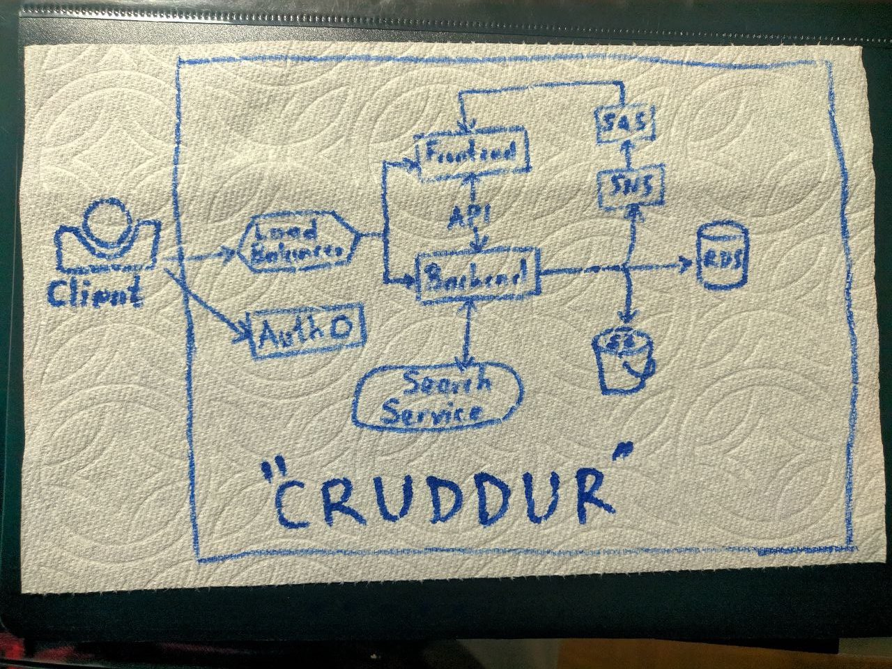
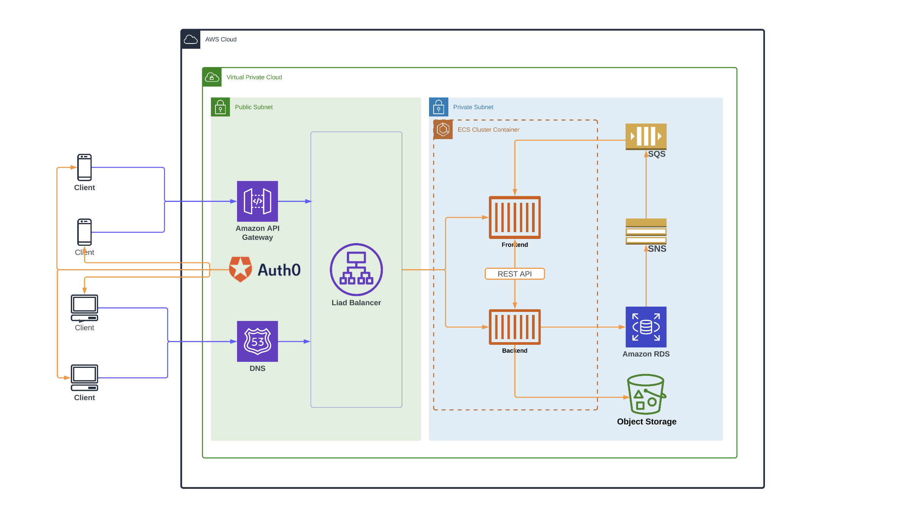
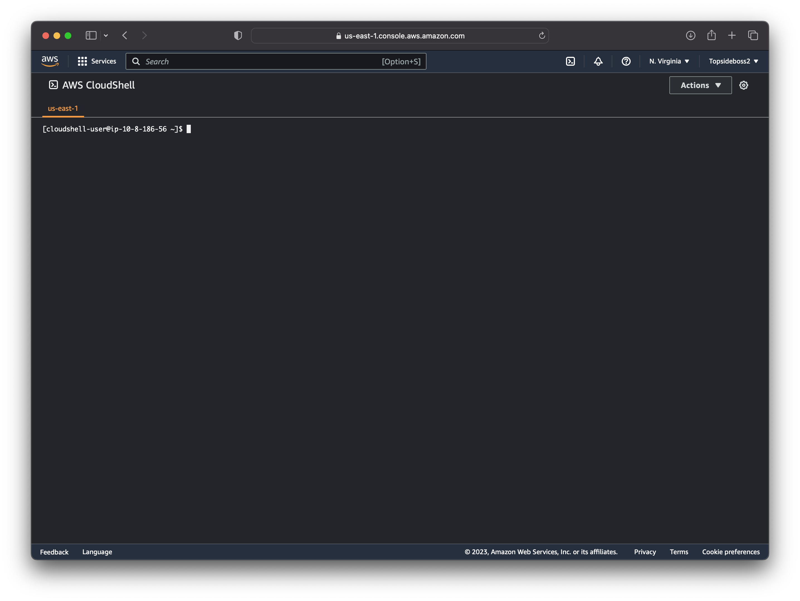
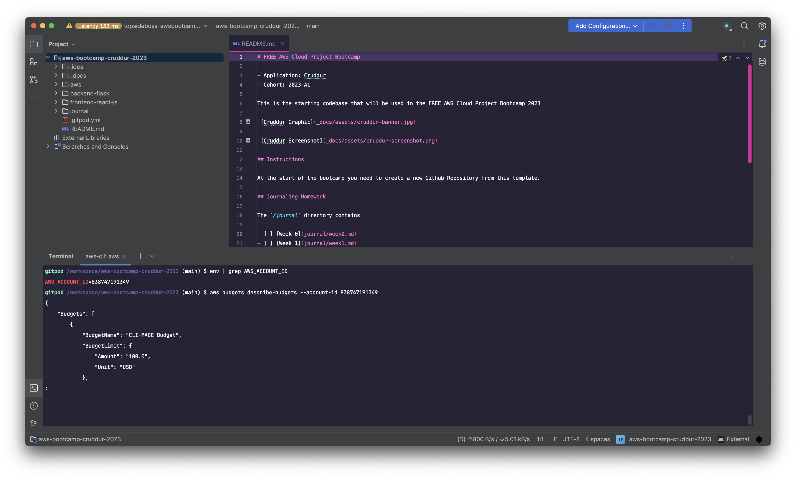

# Week 0 — Billing and Architecture

# Types of Architecture Diagrams
## 1. Conceptual Architecture Diagram

A Conceptual Architecture Diagram is also known as a "Napkin Design". The main objective of this architecture diagram is to highlight the relationship between key components and is often workflow oriented.



## 2. Logical Architecture Diagram

A Logical Architecture Diagram defines how the system should be implemented. The main objective of a logical architecture diagram is to describe how a solution works in terms of function and logical information.




Kindly find the link to my lucid app project [here](https://lucid.app/lucidchart/958a9d75-c6e5-46ac-aa90-f3e5e8c5a2c3/edit?viewport_loc=-317%2C-326%2C2566%2C1498%2C0_0&invitationId=inv_a299805e-ef02-467d-9672-6a97eada16e0).

## 3. Physical Architecture Diagram

This is a very detail oriented architecture diagram that depicts physical elements that enable the infrastructure team to do their work including server models, databases, network, zones, systems, subsystems and connectivity. It is often very detail oriented and will not be readily understandable by business users but familiar to developers.

# What is CloudShell?

AWS CloudShell is a browser-based shell that gives you command-line access to your AWS resources in the selected AWS region. AWS CloudShell comes pre-installed with popular tools for resource management and creation. Enjoy pre-installed tools such as AWS CLI, Python, Node.js. 1GB of storage is included free per AWS region. Files saved in the home directory are available in future sessions for the same AWS region.
You have the same credentials as you used to log in to the console. 



#  What is AWS CLI?

AWS Command Line Interface(AWS CLI) is a unified tool which allows you to manage and monitor all your AWS services from a terminal session on your client.

The benefits of the AWS CLI are 
* Easy Installation
* Saves Time
* Automates Processes

Despite being user-friendly, AWS Management Console is quite a hassle sometimes. But with AWS CLI, if you know the right command, the entire task will just take a few seconds.
A developer may decide to use the AWS CLI over other methods because it offers more granular control of services and enables script automation. 
Here is the format of a basic AWS CLI command: 

```
aws <command> <subcommand> [options and/or parameters]
```

# What is an AWS Budget?

AWS Budgets gives you the ability to set custom budgets that alert you when your costs or usage exceed (or are forecasted to exceed) your budgeted amount. You can also use AWS Budgets to set RI utilization or coverage targets and receive alerts when your utilization drops below the threshold you define. RI alerts support Amazon EC2, Amazon RDS, Amazon Redshift, and Amazon ElastiCache reservations.
Budgets can be tracked at the monthly, quarterly, or yearly level, and you can customize the start and end dates. You can further refine your budget to track costs associated with multiple dimensions, such as AWS service, linked account, tag, and others. Budget alerts can be sent via email and/or Amazon Simple Notification Service (SNS) topic.
Budgets can be created and tracked from the AWS Budgets dashboard or via the Budgets API.

