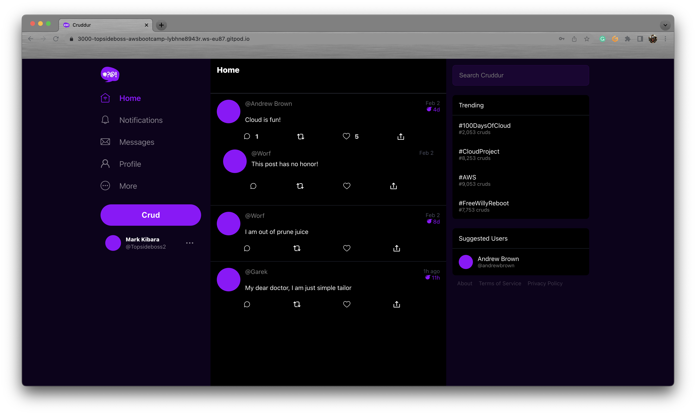
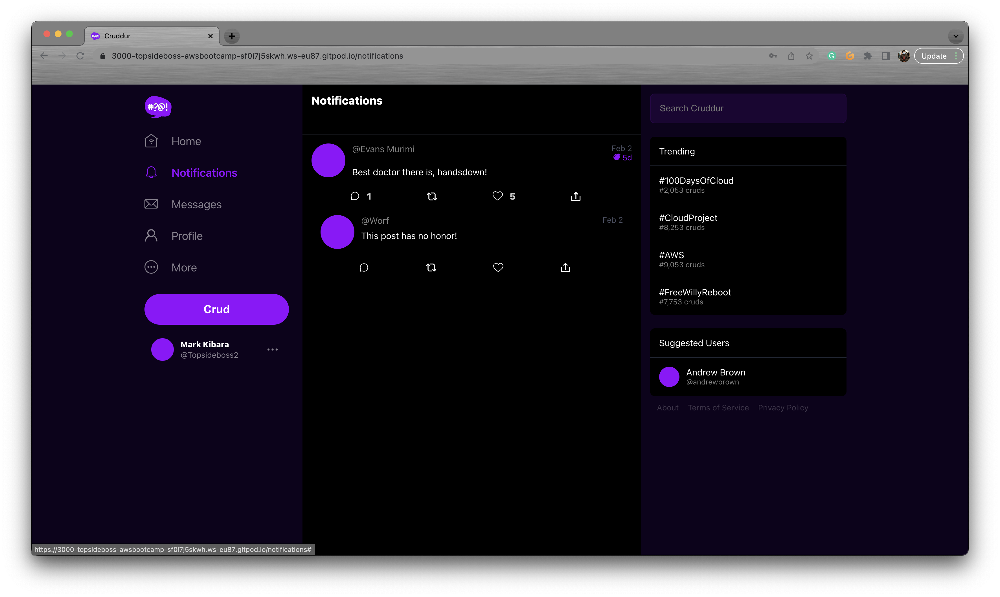
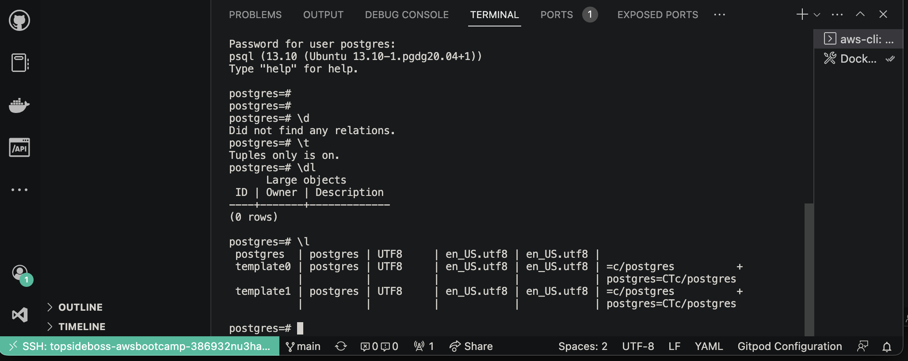
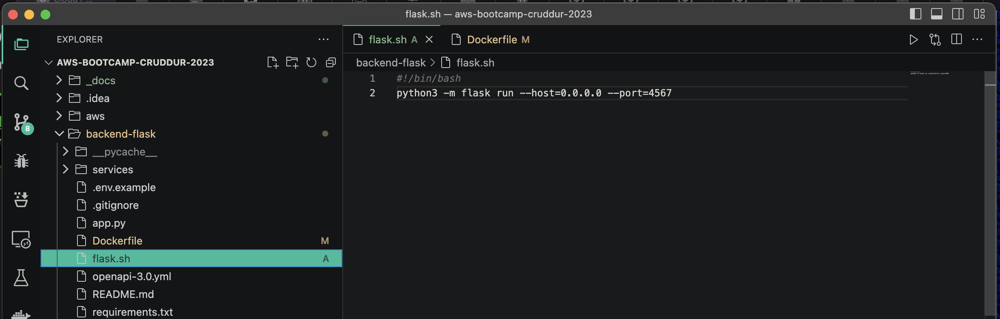
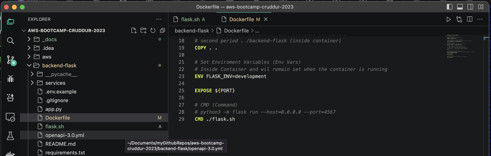
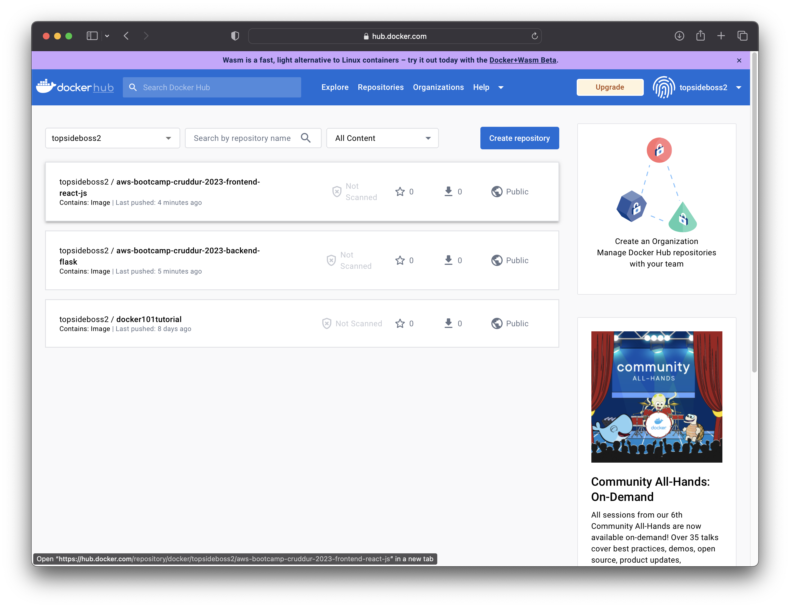
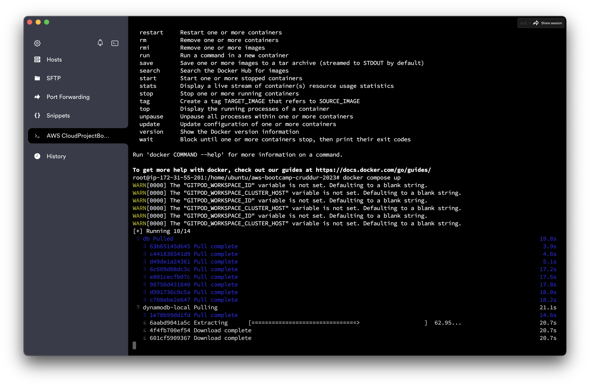

# Week 1 — App Containerization

## Topics
* [Containerize Backend and Frontend Individually](https://github.com/Topsideboss2/aws-bootcamp-cruddur-2023/blob/main/journal/week1.md#containerization-of-frontend-and-backend)
* [Container Orchestration of Backend and Frontend using docker-compose](https://github.com/Topsideboss2/aws-bootcamp-cruddur-2023/blob/main/journal/week1.md#docker-compose)
* [Create the Backend and Frontend Notification Feature in Flask and React respectively](https://github.com/Topsideboss2/aws-bootcamp-cruddur-2023/blob/main/journal/week1.md#creating-the-backend-and-frontend-notification-feature)
* [Accessing the API through Open API]()
* [Configure DynamoDB and PostgreSQL](https://github.com/Topsideboss2/aws-bootcamp-cruddur-2023/blob/main/journal/week1.md#configure-dynamodb-and-postgresql)
* [Running the Dockerfile CMD as an external script](https://github.com/Topsideboss2/aws-bootcamp-cruddur-2023/blob/main/journal/week1.md#running-the-dockerfile-cmd-as-an-external-script)
* [Pushing and tagging an image to Dockerhub](https://github.com/Topsideboss2/aws-bootcamp-cruddur-2023/blob/main/journal/week1.md#pushing-an-image-to-dockerhub)
* [Installing and running docker containers on local machine](https://github.com/Topsideboss2/aws-bootcamp-cruddur-2023/blob/main/journal/week1.md#installing-and-running-docker-containers-on-localhost)
* [Install Docker on EC2 Instance and run containers](https://github.com/Topsideboss2/aws-bootcamp-cruddur-2023/blob/main/journal/week1.md#install-docker-on-ec2-instance-and-run-containers)

### Containerization of Frontend and Backend

#### What is a Dockerfile?
 A dockerfile (saved as `Dockerfile`) is a file that contains all the commands a user would call on the command line to assemble an image.
 
### Backend Dockerfile
Before we run the Backend Dockerfile we need the `requirements.txt` file where the dockerfile will be instructed to install the contents of this requirements file.

`requirements.txt` file:
```
flask
flask-cors
```

`Dockerfile` itself:
```
FROM python:3.10-slim-buster

ENV PORT=4567

WORKDIR /backend-flask

COPY requirements.txt requirements.txt

RUN pip3 install -r requirements.txt

COPY . .

ENV FLASK_ENV=development

EXPOSE ${PORT}

CMD [ "python3", "-m" , "flask", "run", "--host=0.0.0.0", "--port=4567"]
```

***Quick sidenote***: I had to include the line `ENV PORT=4567` because when running the dockerfile in my local environment I was having challenges opening the port to the public 

To build the image run
```
docker build -t backend-flask ./backend-flask
```

To run the image


### Frontend Dockerfile
This was similar to backend and didn't need as many commands.

`Dockerfile` :
```
FROM node:16.18

ENV PORT=3000

COPY . /frontend-react-js
WORKDIR /frontend-react-js
RUN npm install
EXPOSE ${PORT}
CMD ["npm", "start"]
```

***Quick Sidenote***: Here, the port was already specified as `ENV PORT=3000` and therefore there was no challenges encountered.

.png)

To check images and running container ids:
```
docker ps
docker images
```

Learned that frontend needs npm installed first. Run:
```
npm i
```
Or simplify workload by adding `npm install` to gitpod.yml to avoid running it manually everytime after launch of giptod.
```
...
 - name: Initialize Frontend and Backend
    init: |
      gp sync-await aws
      cd /workspace/aws-bootcamp-cruddur-2023/backend-flask
      pip3 install -r requirements.txt
      cd /workspace/aws-bootcamp-cruddur-2023/frontend-react-js
      npm i  
...
```
Also learned that with vs code one can attach a shell of a container and add environment variables in the shell of the container

### Docker-compose

Learned that to run multiple containers in docker, we use `docker compose up` or `docker-compose up`

To kill these containers use the `docker compose down` or `docker-compose down`
Or you could simply right-click on the file in VS Code and choose "Compose Up" or "Compose Down" as you please

The file is `docker-compose.yml`:
```
version: "3.8"
services:
  backend-flask:
    environment:
      FRONTEND_URL: "https://3000-${GITPOD_WORKSPACE_ID}.${GITPOD_WORKSPACE_CLUSTER_HOST}"
      BACKEND_URL: "https://4567-${GITPOD_WORKSPACE_ID}.${GITPOD_WORKSPACE_CLUSTER_HOST}"
    build: ./backend-flask
    ports:
      - "4567:4567"
    volumes:
      - ./backend-flask:/backend-flask
  frontend-react-js:
    environment:
      REACT_APP_BACKEND_URL: "https://4567-${GITPOD_WORKSPACE_ID}.${GITPOD_WORKSPACE_CLUSTER_HOST}"
    build: ./frontend-react-js
    ports:
      - "3000:3000"
    volumes:
      - ./frontend-react-js:/frontend-react-js
networks: 
  internal-network:
    driver: bridge
    name: cruddur

```

### Creating The Backend and Frontend Notification Feature

When logging in to the web application the notification feature does not work and needs to be added as a functionality



After following the [YoutubeLink](https://www.youtube.com/watch?v=k-_o0cCpksk&list=PLBfufR7vyJJ7k25byhRXJldB5AiwgNnWv&index=27) by [AndrewBrown](https://twitter.com/andrewbrown?s=21&t=xmLPQvVKkEScBoXv2ELt9A), the link was up and running



### Configure DynamoDB and PostgreSQL

Modify the `docker-compose.yml` file:

```
...
  dynamodb-local:
    # https://stackoverflow.com/questions/67533058/persist-local-dynamodb-data-in-volumes-lack-permission-unable-to-open-databa
    # We needed to add user:root to get this working.
    user: root
    command: "-jar DynamoDBLocal.jar -sharedDb -dbPath ./data"
    image: "amazon/dynamodb-local:latest"
    container_name: dynamodb-local
    ports:
      - "8000:8000"
    volumes:
      - "./docker/dynamodb:/home/dynamodblocal/data"
    working_dir: /home/dynamodblocal
  db:
    image: postgres:13-alpine
    restart: always
    environment:
      - POSTGRES_USER=postgres
      - POSTGRES_PASSWORD=password
    ports:
      - '5432:5432'
    volumes: 
      - db:/var/lib/postgresql/data
...

...
volumes:
  db:
    driver: local
```

Using postgresql CLI:
```
psql -h localhost -U postgres
```



### Running the Dockerfile CMD as an external script

Create a bash file `flask.sh`:
```
#!/bin/bash
python3 -m flash run --host=0.0.0.0 --port=4567
```



Modify your Dockerfile:
```
CMD ./flask.sh
```



Build the new image of the container:
```
docker build -t backend-flask ./backend-flask
```

Run an instance of the image as a container:
```
docker run -d --rm -p 4567:4567 -it -e FRONTEND_URL='*' -e BACKEND_URL='*' backend-flask
```

### Pushing an image to Dockerhub

Login to dockerhub on the CLI with the following command: 
```
docker login
```

Tag the image
```
docker tag <imagename> <yourdockehubusername>/<imagename>
```

Push the image
```
docker push <yourdockehubusername>/<imagename>
```



### Installing and running Docker containers on Localhost

I did the exact same thing I did on gitpod but backend was not communicating with the frontend.

.png)

I then realized that my backend port was not open so I decided to add another layer on the `Dockerfile` for backend-flask directory.  

```
ENV PORT=4567
...
EXPOSE ${PORT}
```

This worked!

.png)

### Install Docker on EC2 Instance and run containers

I was able to launch an instance and pull my repo and install docker and run my containers

Also changed directory to `frontend-react` and run the command `npm i`

Running on Termius: 



log:
```
root@ip-172-31-55-201:/home/ubuntu/aws-bootcamp-cruddur-2023# docker compose up
WARN[0000] The "GITPOD_WORKSPACE_ID" variable is not set. Defaulting to a blank string. 
WARN[0000] The "GITPOD_WORKSPACE_CLUSTER_HOST" variable is not set. Defaulting to a blank string. 
WARN[0000] The "GITPOD_WORKSPACE_ID" variable is not set. Defaulting to a blank string. 
WARN[0000] The "GITPOD_WORKSPACE_CLUSTER_HOST" variable is not set. Defaulting to a blank string. 
WARN[0000] The "GITPOD_WORKSPACE_ID" variable is not set. Defaulting to a blank string. 
WARN[0000] The "GITPOD_WORKSPACE_CLUSTER_HOST" variable is not set. Defaulting to a blank string. 
[+] Running 14/14
 ⠿ db Pulled                                                                                                            19.8s
   ⠿ 63b65145d645 Pull complete                                                                                          3.9s
   ⠿ c441836541d9 Pull complete                                                                                          4.6s
   ⠿ d49de1a24361 Pull complete                                                                                          5.1s
   ⠿ 6c609d08dc3c Pull complete                                                                                         17.2s
   ⠿ e801cecfb07c Pull complete                                                                                         17.6s
   ⠿ 98756d431840 Pull complete                                                                                         17.8s
   ⠿ d991736c9c5a Pull complete                                                                                         18.0s
   ⠿ c708ebe2e647 Pull complete                                                                                         18.2s
 ⠿ dynamodb-local Pulled                                                                                                25.4s
   ⠿ 1e78b99dd1fd Pull complete                                                                                         14.6s
   ⠿ 6aabd9041a5c Pull complete                                                                                         23.7s
   ⠿ 4f4fb700ef54 Pull complete                                                                                         23.8s
   ⠿ 601cf5909367 Pull complete                                                                                         24.9s
[+] Building 124.4s (18/18) FINISHED                                                                                          
 => [aws-bootcamp-cruddur-2023_backend-flask internal] load build definition from Dockerfile                             0.3s
 => => transferring dockerfile: 897B                                                                                     0.0s
 => [aws-bootcamp-cruddur-2023_backend-flask internal] load .dockerignore                                                0.2s
 => => transferring context: 2B                                                                                          0.0s
 => [aws-bootcamp-cruddur-2023_frontend-react-js internal] load build definition from Dockerfile                         0.2s
 => => transferring dockerfile: 175B                                                                                     0.0s
 => [aws-bootcamp-cruddur-2023_frontend-react-js internal] load .dockerignore                                            0.2s
 => => transferring context: 2B                                                                                          0.0s
 => [aws-bootcamp-cruddur-2023_backend-flask internal] load metadata for docker.io/library/python:3.10-slim-buster       0.5s
 => [aws-bootcamp-cruddur-2023_frontend-react-js internal] load metadata for docker.io/library/node:16.18                0.4s
 => [aws-bootcamp-cruddur-2023_frontend-react-js internal] load build context                                            0.2s
 => => transferring context: 1.44MB                                                                                      0.2s
 => [aws-bootcamp-cruddur-2023_frontend-react-js 1/4] FROM docker.io/library/node:16.18@sha256:7f404d09ceb780c51f4fac7  44.4s
 => => resolve docker.io/library/node:16.18@sha256:7f404d09ceb780c51f4fac7592c46b8f21211474aacce25389eb0df06aaa7472      0.0s
 => => sha256:fae29f309a72482bf13fbb1a8f4889ab9107fcad0c9fda76586aa55445e93ded 7.86MB / 7.86MB                           0.7s
 => => sha256:7f404d09ceb780c51f4fac7592c46b8f21211474aacce25389eb0df06aaa7472 776B / 776B                               0.0s
 => => sha256:46a10b2d8f2e9ae5c5e8ffedd5ae18a960d64b8c39c09e24fe2ee41d7148c249 2.21kB / 2.21kB                           0.0s
 => => sha256:993a4cf9c1e80aa74567d3deea4dfa1488b94dcb024bfca9246f979845763509 7.51kB / 7.51kB                           0.0s
 => => sha256:620af4e91dbf80032eee9f1ff66a8b04119d7a329b2a13e007d69c8a0b337bf0 50.45MB / 50.45MB                         2.3s
 => => sha256:28fca74d99b6532401bfe63d36e1bafb1ac839564d48aa4e6e0a6aa2706a4d12 10.00MB / 10.00MB                         0.6s
 => => sha256:0b5db87f5b42af9f258f14f367616814cb9b518ea0141f46bdd2706bb256d408 51.84MB / 51.84MB                         3.1s
 => => sha256:fa488706ea13a788b351252b655f6ccb88201c4bace57cf25408fda65758c518 191.89MB / 191.89MB                      10.5s
 => => sha256:0380b9b3282fe25f00e7d8191dacb0167d90b7b881f05ff9b1ca72bcd38b9a6b 4.20kB / 4.20kB                           2.4s
 => => sha256:383dfecd36873ac6c0fc1feb73b2febfa30a5502bea0566c51cf170234248004 34.97MB / 34.97MB                         5.9s
 => => extracting sha256:620af4e91dbf80032eee9f1ff66a8b04119d7a329b2a13e007d69c8a0b337bf0                               10.0s
 => => sha256:ca59981dc274124ea3f9d421b039e54062b53aba0c04f536bbe2545a80bdba51 2.28MB / 2.28MB                           3.4s
 => => sha256:4fa5c4b55a850ac871248b30c51c35c6c77adbc12258b823a725d84a6853dbc2 450B / 450B                               3.5s
 => => extracting sha256:fae29f309a72482bf13fbb1a8f4889ab9107fcad0c9fda76586aa55445e93ded                                1.5s
 => => extracting sha256:28fca74d99b6532401bfe63d36e1bafb1ac839564d48aa4e6e0a6aa2706a4d12                                0.9s
 => => extracting sha256:0b5db87f5b42af9f258f14f367616814cb9b518ea0141f46bdd2706bb256d408                                9.2s
 => => extracting sha256:fa488706ea13a788b351252b655f6ccb88201c4bace57cf25408fda65758c518                               13.8s
 => => extracting sha256:0380b9b3282fe25f00e7d8191dacb0167d90b7b881f05ff9b1ca72bcd38b9a6b                                0.0s
 => => extracting sha256:383dfecd36873ac6c0fc1feb73b2febfa30a5502bea0566c51cf170234248004                                2.6s
 => => extracting sha256:ca59981dc274124ea3f9d421b039e54062b53aba0c04f536bbe2545a80bdba51                                0.5s
 => => extracting sha256:4fa5c4b55a850ac871248b30c51c35c6c77adbc12258b823a725d84a6853dbc2                                0.0s
 => [aws-bootcamp-cruddur-2023_backend-flask 1/5] FROM docker.io/library/python:3.10-slim-buster@sha256:c059afb019e7ae  16.4s
 => => resolve docker.io/library/python:3.10-slim-buster@sha256:c059afb019e7aea99777e54b3e0ff8c970ef552b737fb4acbd84291  0.1s
 => => sha256:c059afb019e7aea99777e54b3e0ff8c970ef552b737fb4acbd842916c751fcfd 988B / 988B                               0.0s
 => => sha256:497b91c87ca7d8bf5e0d07d59db1c3e5f29d36ccca1f9878719123e9fbc8f144 1.37kB / 1.37kB                           0.0s
 => => sha256:934047247b20ffd13894ccfd0997208c2e20ec7ba385f40e15d56df2a2912d43 7.79kB / 7.79kB                           0.0s
 => => sha256:29cd48154c03e9242f1ff4f9895cf886a344fb94c9b71029455e76e11214328f 27.14MB / 27.14MB                         4.1s
 => => sha256:2c59e55cfd719490e5070eb007a3b0ffde33d3e36171a573a3224a050c1e341d 2.78MB / 2.78MB                           4.4s
 => => extracting sha256:29cd48154c03e9242f1ff4f9895cf886a344fb94c9b71029455e76e11214328f                                6.2s
 => => sha256:3b4b58298de0d8fc8f69c675c463afab2beb87c60a81d13b5620c6b87ee42cbb 11.47MB / 11.47MB                         4.7s
 => => sha256:6239e464c1ab2cca0154db8e88c6b2eb8969c76dd4cdf8e67e03be54df84ac33 232B / 232B                               4.8s
 => => sha256:609722ad05b6850bc85fa5089312a3294fabfb20978d107d898d4f7804a9269e 3.35MB / 3.35MB                           5.0s
 => => extracting sha256:2c59e55cfd719490e5070eb007a3b0ffde33d3e36171a573a3224a050c1e341d                                1.5s
 => => extracting sha256:3b4b58298de0d8fc8f69c675c463afab2beb87c60a81d13b5620c6b87ee42cbb                                2.2s
 => => extracting sha256:6239e464c1ab2cca0154db8e88c6b2eb8969c76dd4cdf8e67e03be54df84ac33                                0.0s
 => => extracting sha256:609722ad05b6850bc85fa5089312a3294fabfb20978d107d898d4f7804a9269e                                1.1s
 => [aws-bootcamp-cruddur-2023_backend-flask internal] load build context                                                0.2s
 => => transferring context: 21.97kB                                                                                     0.1s
 => [aws-bootcamp-cruddur-2023_backend-flask 2/5] WORKDIR /backend-flask                                                 0.2s
 => [aws-bootcamp-cruddur-2023_backend-flask 3/5] COPY requirements.txt requirements.txt                                 0.1s
 => [aws-bootcamp-cruddur-2023_backend-flask 4/5] RUN pip3 install -r requirements.txt                                   9.4s
 => [aws-bootcamp-cruddur-2023_backend-flask 5/5] COPY . .                                                               0.1s
 => [aws-bootcamp-cruddur-2023_frontend-react-js] exporting to image                                                    33.3s
 => => exporting layers                                                                                                 32.7s
 => => writing image sha256:8741732eb5fb2293d3861d32a821e3ac9187f187b32e13bce5c036ecdd84dc47                             0.0s
 => => naming to docker.io/library/aws-bootcamp-cruddur-2023_backend-flask                                               0.0s
 => => writing image sha256:46e54a2ebe04716bfadc82171945f802748346cda3a5975c65c2d911e8edb1cd                             0.0s
 => => naming to docker.io/library/aws-bootcamp-cruddur-2023_frontend-react-js                                           0.0s
 => [aws-bootcamp-cruddur-2023_frontend-react-js 2/4] COPY . /frontend-react-js                                          0.5s
 => [aws-bootcamp-cruddur-2023_frontend-react-js 3/4] WORKDIR /frontend-react-js                                         0.1s
 => [aws-bootcamp-cruddur-2023_frontend-react-js 4/4] RUN npm install                                                   45.4s
[+] Running 6/6
 ⠿ Network aws-bootcamp-cruddur-2023_default                Created                                                      0.3s
 ⠿ Volume "aws-bootcamp-cruddur-2023_db"                    Created                                                      0.0s
 ⠿ Container aws-bootcamp-cruddur-2023-frontend-react-js-1  Created                                                      0.3s
 ⠿ Container dynamodb-local                                 Created                                                      0.3s
 ⠿ Container aws-bootcamp-cruddur-2023-db-1                 Created                                                      0.3s
 ⠿ Container aws-bootcamp-cruddur-2023-backend-flask-1      Cre...                                                       0.3s
Attaching to aws-bootcamp-cruddur-2023-backend-flask-1, aws-bootcamp-cruddur-2023-db-1, aws-bootcamp-cruddur-2023-frontend-react-js-1, dynamodb-local
aws-bootcamp-cruddur-2023-db-1                 | The files belonging to this database system will be owned by user "postgres".
aws-bootcamp-cruddur-2023-db-1                 | This user must also own the server process.
aws-bootcamp-cruddur-2023-db-1                 | 
aws-bootcamp-cruddur-2023-db-1                 | The database cluster will be initialized with locale "en_US.utf8".
aws-bootcamp-cruddur-2023-db-1                 | The default database encoding has accordingly been set to "UTF8".
aws-bootcamp-cruddur-2023-db-1                 | The default text search configuration will be set to "english".
aws-bootcamp-cruddur-2023-db-1                 | 
aws-bootcamp-cruddur-2023-db-1                 | Data page checksums are disabled.
aws-bootcamp-cruddur-2023-db-1                 | 
aws-bootcamp-cruddur-2023-db-1                 | fixing permissions on existing directory /var/lib/postgresql/data ... ok
aws-bootcamp-cruddur-2023-db-1                 | creating subdirectories ... ok
aws-bootcamp-cruddur-2023-db-1                 | selecting dynamic shared memory implementation ... posix
aws-bootcamp-cruddur-2023-db-1                 | selecting default max_connections ... 100
aws-bootcamp-cruddur-2023-db-1                 | selecting default shared_buffers ... 128MB
dynamodb-local                                 | Initializing DynamoDB Local with the following configuration:
dynamodb-local                                 | Port:  8000
dynamodb-local                                 | InMemory:      false
dynamodb-local                                 | DbPath:        ./data
dynamodb-local                                 | SharedDb:      true
dynamodb-local                                 | shouldDelayTransientStatuses:  false
dynamodb-local                                 | CorsParams:    null
dynamodb-local                                 | 
aws-bootcamp-cruddur-2023-backend-flask-1      | 'FLASK_ENV' is deprecated and will not be used in Flask 2.3. Use 'FLASK_DEBUG' instead.
aws-bootcamp-cruddur-2023-backend-flask-1      | 'FLASK_ENV' is deprecated and will not be used in Flask 2.3. Use 'FLASK_DEBUG' instead.
aws-bootcamp-cruddur-2023-backend-flask-1      | 'FLASK_ENV' is deprecated and will not be used in Flask 2.3. Use 'FLASK_DEBUG' instead.
aws-bootcamp-cruddur-2023-backend-flask-1      |  * Debug mode: on
aws-bootcamp-cruddur-2023-db-1                 | selecting default time zone ... UTC
aws-bootcamp-cruddur-2023-db-1                 | creating configuration files ... ok
aws-bootcamp-cruddur-2023-backend-flask-1      | WARNING: This is a development server. Do not use it in a production deployment. Use a production WSGI server instead.
aws-bootcamp-cruddur-2023-backend-flask-1      |  * Running on all addresses (0.0.0.0)
aws-bootcamp-cruddur-2023-backend-flask-1      |  * Running on http://127.0.0.1:4567
aws-bootcamp-cruddur-2023-backend-flask-1      |  * Running on http://172.18.0.2:4567
aws-bootcamp-cruddur-2023-backend-flask-1      | Press CTRL+C to quit
aws-bootcamp-cruddur-2023-backend-flask-1      |  * Restarting with stat
aws-bootcamp-cruddur-2023-frontend-react-js-1  | 
aws-bootcamp-cruddur-2023-frontend-react-js-1  | > frontend@0.1.0 start
aws-bootcamp-cruddur-2023-frontend-react-js-1  | > react-scripts start
aws-bootcamp-cruddur-2023-frontend-react-js-1  | 
aws-bootcamp-cruddur-2023-frontend-react-js-1  | sh: 1: react-scripts: not found
aws-bootcamp-cruddur-2023-db-1                 | running bootstrap script ... ok
aws-bootcamp-cruddur-2023-frontend-react-js-1 exited with code 127
aws-bootcamp-cruddur-2023-backend-flask-1      | 'FLASK_ENV' is deprecated and will not be used in Flask 2.3. Use 'FLASK_DEBUG' instead.
aws-bootcamp-cruddur-2023-backend-flask-1      | 'FLASK_ENV' is deprecated and will not be used in Flask 2.3. Use 'FLASK_DEBUG' instead.
aws-bootcamp-cruddur-2023-backend-flask-1      | 'FLASK_ENV' is deprecated and will not be used in Flask 2.3. Use 'FLASK_DEBUG' instead.
aws-bootcamp-cruddur-2023-backend-flask-1      |  * Debugger is active!
aws-bootcamp-cruddur-2023-backend-flask-1      |  * Debugger PIN: 234-627-036
aws-bootcamp-cruddur-2023-db-1                 | performing post-bootstrap initialization ... sh: locale: not found
aws-bootcamp-cruddur-2023-db-1                 | 2023-02-25 16:20:46.890 UTC [30] WARNING:  no usable system locales were found
aws-bootcamp-cruddur-2023-db-1                 | ok
aws-bootcamp-cruddur-2023-db-1                 | syncing data to disk ... ok
aws-bootcamp-cruddur-2023-db-1                 | 
aws-bootcamp-cruddur-2023-db-1                 | initdb: warning: enabling "trust" authentication for local connections
aws-bootcamp-cruddur-2023-db-1                 | You can change this by editing pg_hba.conf or using the option -A, or
aws-bootcamp-cruddur-2023-db-1                 | --auth-local and --auth-host, the next time you run initdb.
aws-bootcamp-cruddur-2023-db-1                 | 
aws-bootcamp-cruddur-2023-db-1                 | Success. You can now start the database server using:
aws-bootcamp-cruddur-2023-db-1                 | 
aws-bootcamp-cruddur-2023-db-1                 |     pg_ctl -D /var/lib/postgresql/data -l logfile start
aws-bootcamp-cruddur-2023-db-1                 | 
aws-bootcamp-cruddur-2023-db-1                 | waiting for server to start....2023-02-25 16:20:48.438 UTC [36] LOG:  starting PostgreSQL 13.10 on x86_64-pc-linux-musl, compiled by gcc (Alpine 12.2.1_git20220924-r4) 12.2.1 20220924, 64-bit
aws-bootcamp-cruddur-2023-db-1                 | 2023-02-25 16:20:48.445 UTC [36] LOG:  listening on Unix socket "/var/run/postgresql/.s.PGSQL.5432"
aws-bootcamp-cruddur-2023-db-1                 | 2023-02-25 16:20:48.461 UTC [37] LOG:  database system was shut down at 2023-02-25 16:20:48 UTC
aws-bootcamp-cruddur-2023-db-1                 | 2023-02-25 16:20:48.469 UTC [36] LOG:  database system is ready to accept connections
aws-bootcamp-cruddur-2023-db-1                 |  done
aws-bootcamp-cruddur-2023-db-1                 | server started
aws-bootcamp-cruddur-2023-db-1                 | 
aws-bootcamp-cruddur-2023-db-1                 | /usr/local/bin/docker-entrypoint.sh: ignoring /docker-entrypoint-initdb.d/*
aws-bootcamp-cruddur-2023-db-1                 | 
aws-bootcamp-cruddur-2023-db-1                 | 2023-02-25 16:20:48.556 UTC [36] LOG:  received fast shutdown request
aws-bootcamp-cruddur-2023-db-1                 | waiting for server to shut down....2023-02-25 16:20:48.561 UTC [36] LOG:  aborting any active transactions
aws-bootcamp-cruddur-2023-db-1                 | 2023-02-25 16:20:48.570 UTC [36] LOG:  background worker "logical replication launcher" (PID 43) exited with exit code 1
aws-bootcamp-cruddur-2023-db-1                 | 2023-02-25 16:20:48.570 UTC [38] LOG:  shutting down
aws-bootcamp-cruddur-2023-db-1                 | 2023-02-25 16:20:48.599 UTC [36] LOG:  database system is shut down
aws-bootcamp-cruddur-2023-db-1                 |  done
aws-bootcamp-cruddur-2023-db-1                 | server stopped
aws-bootcamp-cruddur-2023-db-1                 | 
aws-bootcamp-cruddur-2023-db-1                 | PostgreSQL init process complete; ready for start up.
aws-bootcamp-cruddur-2023-db-1                 | 
aws-bootcamp-cruddur-2023-db-1                 | 2023-02-25 16:20:48.706 UTC [1] LOG:  starting PostgreSQL 13.10 on x86_64-pc-linux-musl, compiled by gcc (Alpine 12.2.1_git20220924-r4) 12.2.1 20220924, 64-bit
aws-bootcamp-cruddur-2023-db-1                 | 2023-02-25 16:20:48.706 UTC [1] LOG:  listening on IPv4 address "0.0.0.0", port 5432
aws-bootcamp-cruddur-2023-db-1                 | 2023-02-25 16:20:48.707 UTC [1] LOG:  listening on IPv6 address "::", port 5432
aws-bootcamp-cruddur-2023-db-1                 | 2023-02-25 16:20:48.714 UTC [1] LOG:  listening on Unix socket "/var/run/postgresql/.s.PGSQL.5432"
aws-bootcamp-cruddur-2023-db-1                 | 2023-02-25 16:20:48.722 UTC [49] LOG:  database system was shut down at 2023-02-25 16:20:48 UTC
aws-bootcamp-cruddur-2023-db-1                 | 2023-02-25 16:20:48.729 UTC [1] LOG:  database system is ready to accept connections
```

