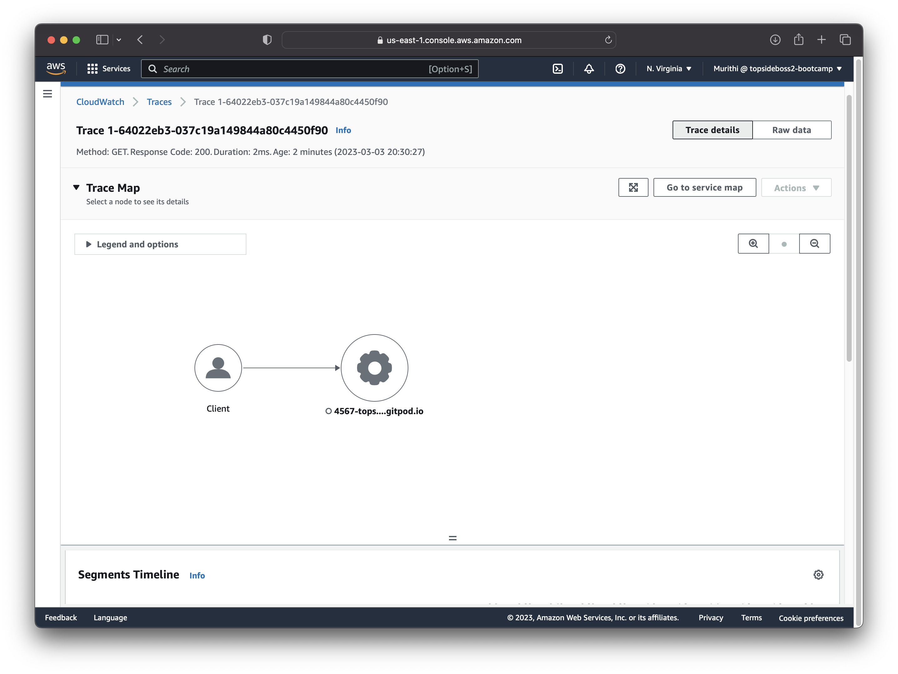

# Week 2 — Distributed Tracing

## Topics
* [Instrument Honeycomb with OpenTelemetry](https://github.com/Topsideboss2/aws-bootcamp-cruddur-2023/blob/main/journal/week2.md#instrument-honeycomb-with-opentelemetry)
* [Instrument AWS X-Ray](https://github.com/Topsideboss2/aws-bootcamp-cruddur-2023/blob/main/journal/week2.md#instrument-aws-x-ray)
* [Configure Cloudwatch logs](https://github.com/Topsideboss2/aws-bootcamp-cruddur-2023/blob/main/journal/week2.md#configure-cloudwatch-logs)
* [Integrate Rollbar](https://github.com/Topsideboss2/aws-bootcamp-cruddur-2023/blob/main/journal/week2.md#integrate-rollbar)
* [Integrate Datadog to monitor Docker Containers](https://github.com/Topsideboss2/aws-bootcamp-cruddur-2023/blob/main/journal/week2.md#integrate-datadog-to-monitor-docker-containers)

## Instrument Honeycomb with OpenTelemetry

### How To Instrument The Backend Flask Application To Use Open Telemetry (OTEL) with Honeycomb.io 
1. Create environment called bootcamp-dev
2. Extract the API Key
3. Export the API Key into gitpod
```
export HONEYCOMB_API_KEY="*****"
gp env HONEYCOMB_API_KEY="*****"
```
4. Initialize, Configure and Install Packages as shown in the [Home Page](https://ui.honeycomb.io/markkibara2014-gettingstarted/environments/aws-bootcamp/datasets/backend-flask/home) of Honeycomb.io
Introduce a tracer using the [OpenTelemetry for Python SDK](https://docs.honeycomb.io/getting-data-in/opentelemetry/python/)
Create a span
**NB** : Service Name should be specific for the service i.e backend-flask
5. Test the new configuration
**NB** : `Docker compose up -d` is what will pass the env variables from the shell to the container shell. Do not right-click into the file on vs code because env variables will not be passed on onto the container.

If there was a request to your backend, you will see a set of data mapped on your home tab as shown below


6. Implement Spans for logs and run queries in Honeycomb
Running queries as shown below:


## Instrument AWS X-Ray

1. Install AWS XRay SDK (boto3)

Add to `requirements.txt`
```shell
pip install aws-xray-sdk
pip freeze >> backend-flask/requirements.txt
```

2. Add Middleware configuration to your flask app.py

3. Add x-ray-json to your json directory in `/aws/json/xray.json`:
```json
{
  "SamplingRule": {
      "RuleName": "Cruddur",
      "ResourceARN": "*",
      "Priority": 9000,
      "FixedRate": 0.1,
      "ReservoirSize": 5,
      "ServiceName": "backend-flask",
      "ServiceType": "*",
      "Host": "*",
      "HTTPMethod": "*",
      "URLPath": "*",
      "Version": 1
  }
}
```

4. Create a group and a sampling rule

```sh
aws xray create-sampling-rule --cli-input-json file://aws/json/xray.json
```

5. Add daemon service to docker compose in `docker-compose.yml`:
```yml
xray-daemon:
    image: "amazon/aws-xray-daemon"
    environment:
      AWS_ACCESS_KEY_ID: "${AWS_ACCESS_KEY_ID}"
      AWS_SECRET_ACCESS_KEY: "${AWS_SECRET_ACCESS_KEY}"
      AWS_REGION: "eu-central-1"
    command:
      - "xray -o -b xray-daemon:2000"
    ports:
      - 2000:2000/udp
```
6. Add env vars to backend-flask in `docker-compose.yml`:
```yml
services:
  backend-flask:
    environment:
    ...
      AWS_XRAY_URL: "*4567-${GITPOD_WORKSPACE_ID}.${GITPOD_WORKSPACE_CLUSTER_HOST}*"
      AWS_XRAY_DAEMON_ADDRESS: "xray-daemon:2000"
```
Trace Maps:




7. Configuring Subsegments


## Configure Cloudwatch logs
1. For CloudWatch logs we will use [watchtower](https://pypi.org/project/watchtower/)

Install Watchtower
```sh 
pip install watchtower
pip freeze >> backend-flask/requirements.txt
```
2. Add configurations to your flask app.py
Importing the libraries
```py
import watchtower
import logging
from time import strftime
```
Setting up the logger
```py
LOGGER = logging.getLogger(__name__)
LOGGER.setLevel(logging.DEBUG)
console_handler = logging.StreamHandler()
cw_handler = watchtower.CloudWatchLogHandler(log_group='cruddur')
LOGGER.addHandler(console_handler)
LOGGER.addHandler(cw_handler)
LOGGER.info("some message")
```

```py
@app.after_request
def after_request(response):
    timestamp = strftime('[%Y-%b-%d %H:%M]')
    LOGGER.error('%s %s %s %s %s %s', timestamp, request.remote_addr, request.method, request.scheme, request.full_path, response.status)
    return response
 ```
Pass the logger variable to app.py
```py
@app.route("/api/activities/home", methods=['GET'])
def data_home():
  data = HomeActivities.run(LOGGER) 
  return data, 200
  ```
In `home_activities.py` add:
Libraries
```py
 import logging
```
 
```py
  def run(LOGGER):
    LOGGER.info("HomeActivities")
```

Adding env vars into docker-compose.yml:
```yml
      AWS_DEFAULT_REGION: "${AWS_DEFAULT_REGION}"
      AWS_ACCESS_KEY_ID: "${AWS_ACCESS_KEY_ID}"
      AWS_SECRET_ACCESS_KEY: "${AWS_SECRET_ACCESS_KEY}"
```


## Integrate Rollbar
1. Install blinker, rollbar
```sh
pip install rollbar
pip install blinker
pip freeze >> backend-flask/requirements.txt
```
2. Set rollbar access token from rollbar website
   
3. Export rollbar access token and add it to your docker-compose.yml
```shell
export ROLLBAR_ACCESS_TOKEN="REDACTED"
gp env ROLLBAR_ACCESS_TOKEN="REDACTED"
```

```yml
ROLLBAR_ACCESS_TOKEN: "${ROLLBAR_ACCESS_TOKEN}"
```

4. Import rollbar libraries to app.py
```py
from time import strftime
import os
import rollbar
import rollbar.contrib.flask
from flask import got_request_exception
```

5. Add configuration to app.py
```py
rollbar_access_token = os.getenv('ROLLBAR_ACCESS_TOKEN')
@app.before_first_request
def init_rollbar():
    """init rollbar module"""
    rollbar.init(
        # access token
        rollbar_access_token,
        # environment name
        'production',
        # server root directory, makes tracebacks prettier
        root=os.path.dirname(os.path.realpath(__file__)),
        # flask already sets up logging
        allow_logging_basic_config=False)
    # send exceptions from `app` to rollbar, using flask's signal system.
    got_request_exception.connect(rollbar.contrib.flask.report_exception, app)
...
py
@app.route('/rollbar/test')
def rollbar_test():
    rollbar.report_message('Hello World!', 'warning')
    return "Hello World!"
```


# Extra Homework

## Integrate Datadog to monitor Docker Containers
I decided to integrate Datadog so that I can be able to monitor my docker containers.
Using the Github StudentPack promo I was able to get a pro account including 10 servers, free for 2 years.


I was able to create a user account and navigate through the [website](https://us5.datadoghq.com) to the following dashboard below.


Here I have listed 4 steps you can easily follow through to integrate Datadog with Docker.

Step 1: Navigate to the Integrations
Step 2: Click on Agent and navigate to the installation page on your desired infrastructure
Step 3: Select API key. This API key is automatically generated. 
Step 4: Copy and paste the following instruction on your shell.


Finally, click on the dashboards page and on the docker-overview button to view your containers that are being monitored.

The output will be as shown below:


## Adding ports in .gitpod.yml
To avoid manually opening ports every time, added ports to .gitpod.yml
```yml
ports:
  - name: frontend
    port: 3000
    onOpen: open-browser
    visibility: public
  - name: backend
    port: 4567
    visibility: public
  - name: xray-daemon
    port: 2000
    visibility: public
```