# Week 3 — Decentralized Authentication

## Topics
* [Setup an Amazon Cognito user-pool through the Amazon Console](https://github.com/Topsideboss2/aws-bootcamp-cruddur-2023/blob/main/journal/week3.md#setup-user-pool)
* [Install AWS Amplify library](https://github.com/Topsideboss2/aws-bootcamp-cruddur-2023/blob/main/journal/week3.md#install-aws-amplify-library)
* [Create and verify a user through the Console and CLI respectively]()
* [Configure authentication on my Sign-in Page](https://github.com/Topsideboss2/aws-bootcamp-cruddur-2023/blob/main/journal/week3.md#sign-in-page)
* [Configure authentication on my Sign-up Page](https://github.com/Topsideboss2/aws-bootcamp-cruddur-2023/blob/main/journal/week3.md#sign-up-page)
* [Configure authentication on my Confirmation Page](https://github.com/Topsideboss2/aws-bootcamp-cruddur-2023/blob/main/journal/week3.md#confirmation-page)
* [Configure authentication on my Password recovery Page](https://github.com/Topsideboss2/aws-bootcamp-cruddur-2023/blob/main/journal/week3.md#password-recovery-page)
* [Implement the use of a JWT to pass API calls to the backend](https://github.com/Topsideboss2/aws-bootcamp-cruddur-2023/blob/main/journal/week3.md#implement-the-use-of-a-json-web-token)

## Setup User-pool
Using the Amazon Console, I was able to create a user-pool with the following steps.
1. Use the search bar to find Amazon Cognito

2. Select create new user pool

3. Configure Sign in experience as shown below
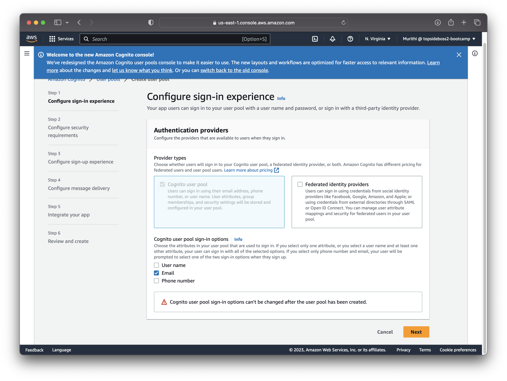

4. Configure security requirements as shown below
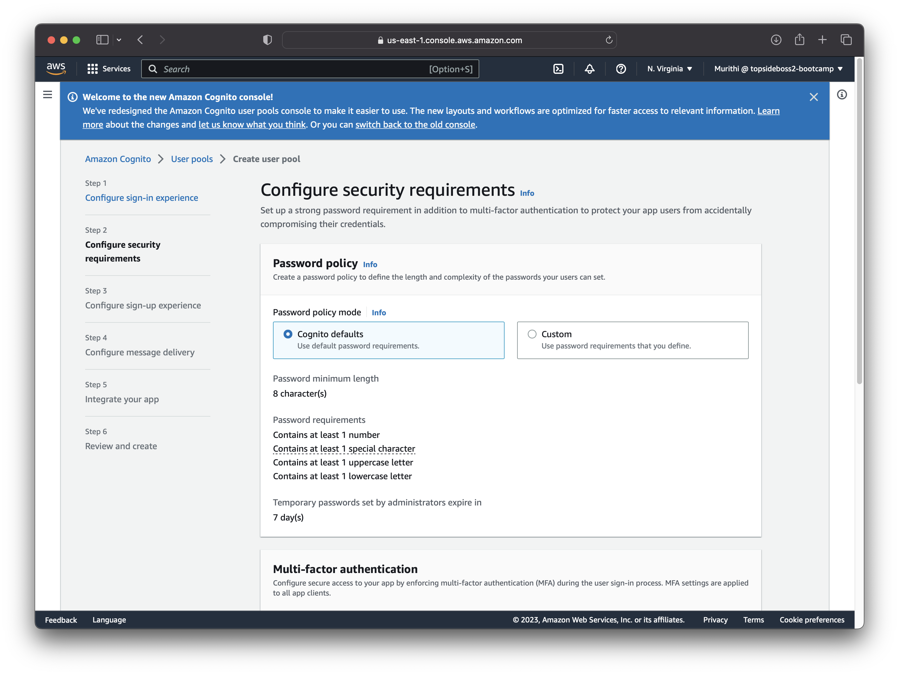
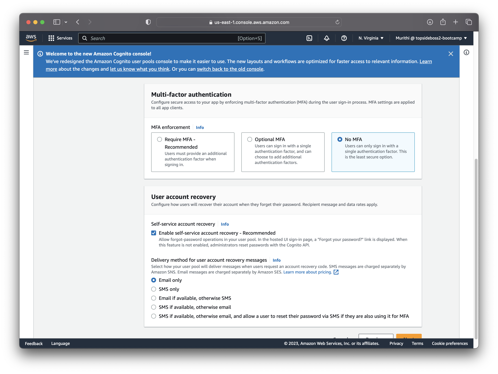

5. Configure Sign up experience as shown below
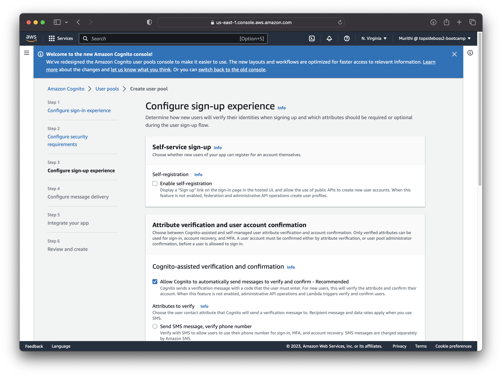
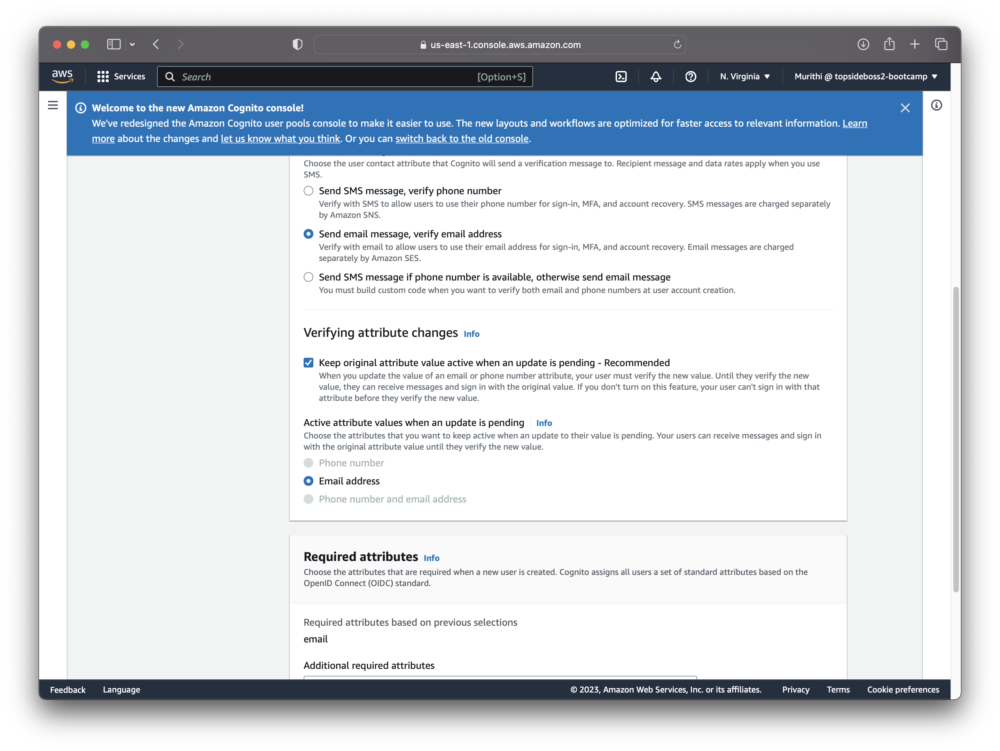
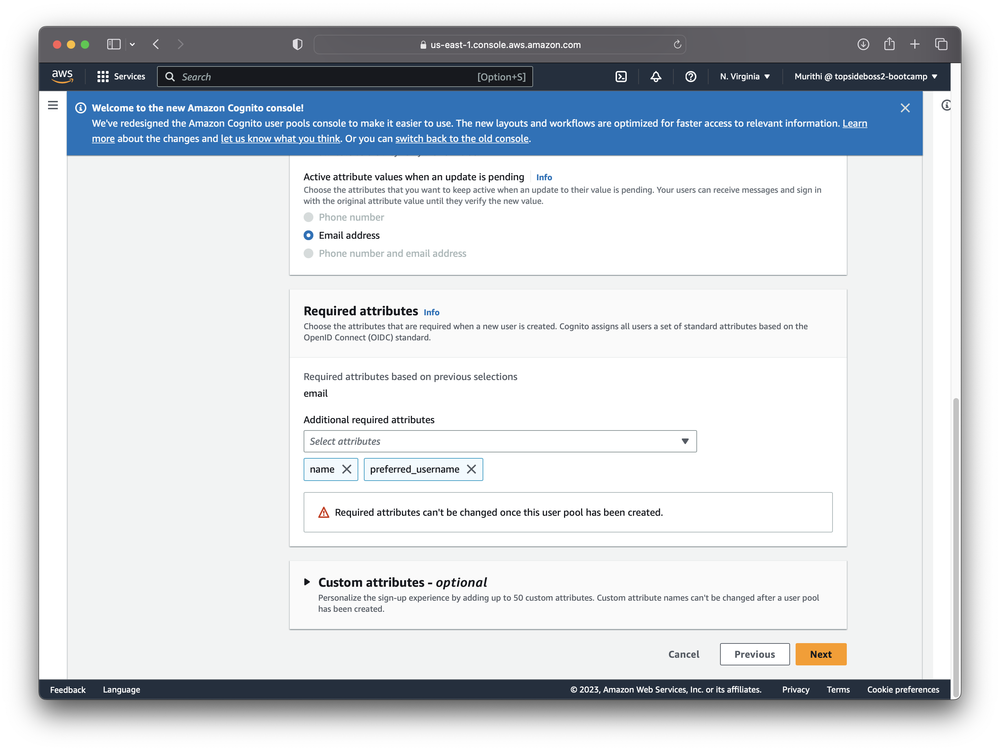

6. Configure message delivery as shown below
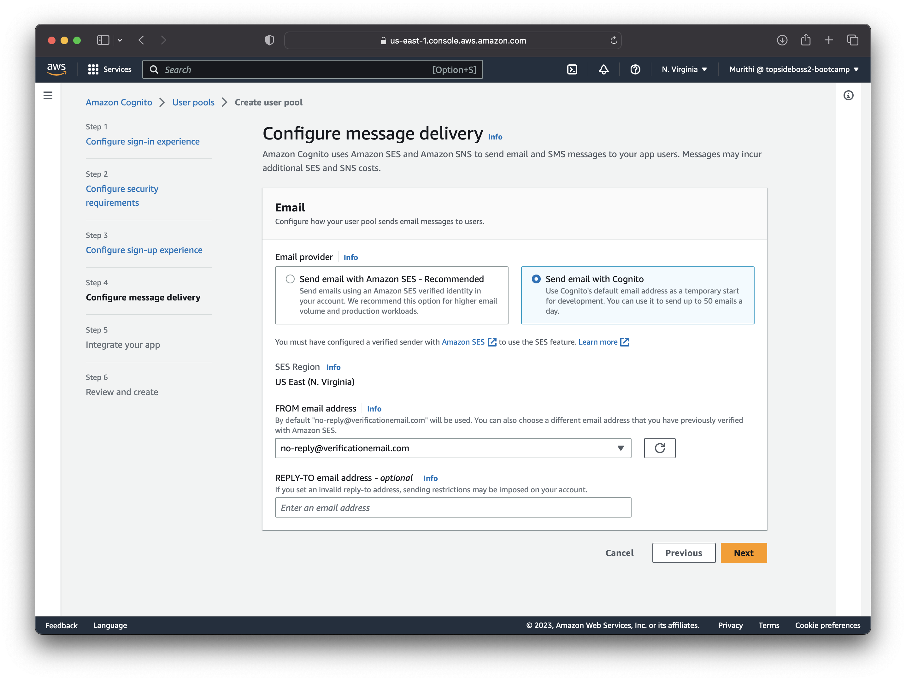

7. Configure app integration as shown below
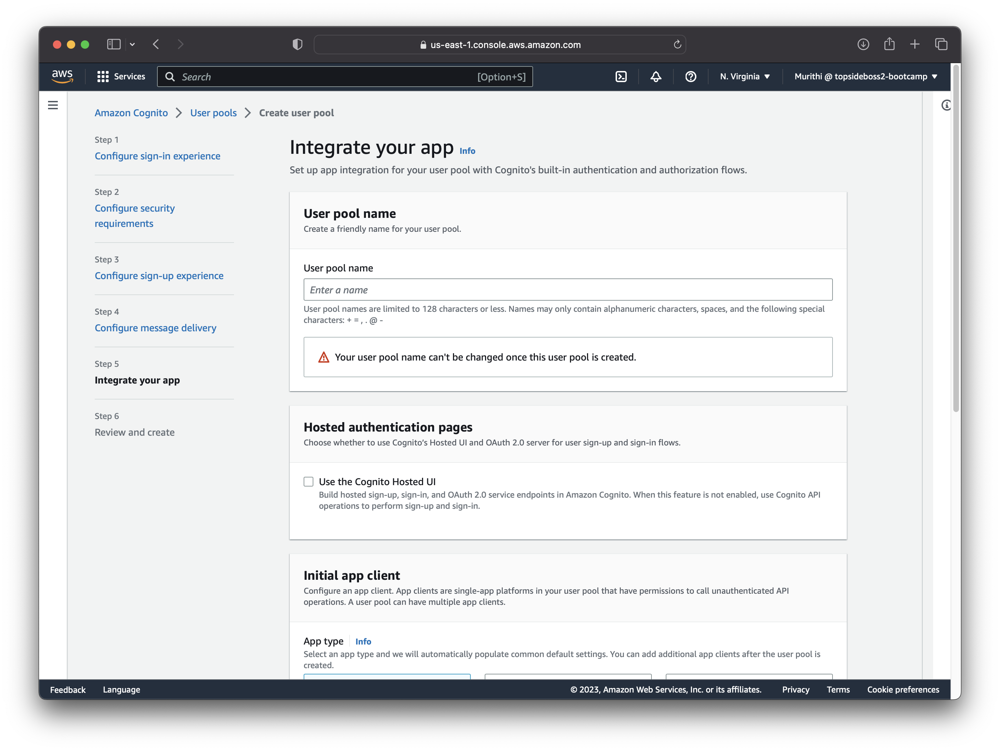
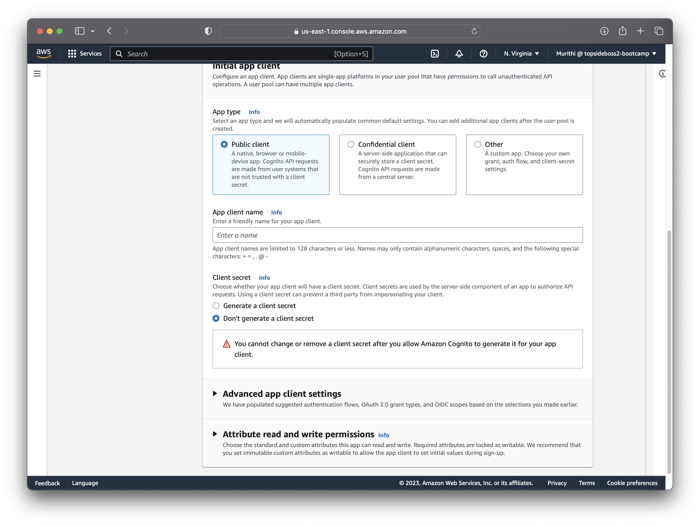

Finally, confirm the user-pool details and home page should be as shown below
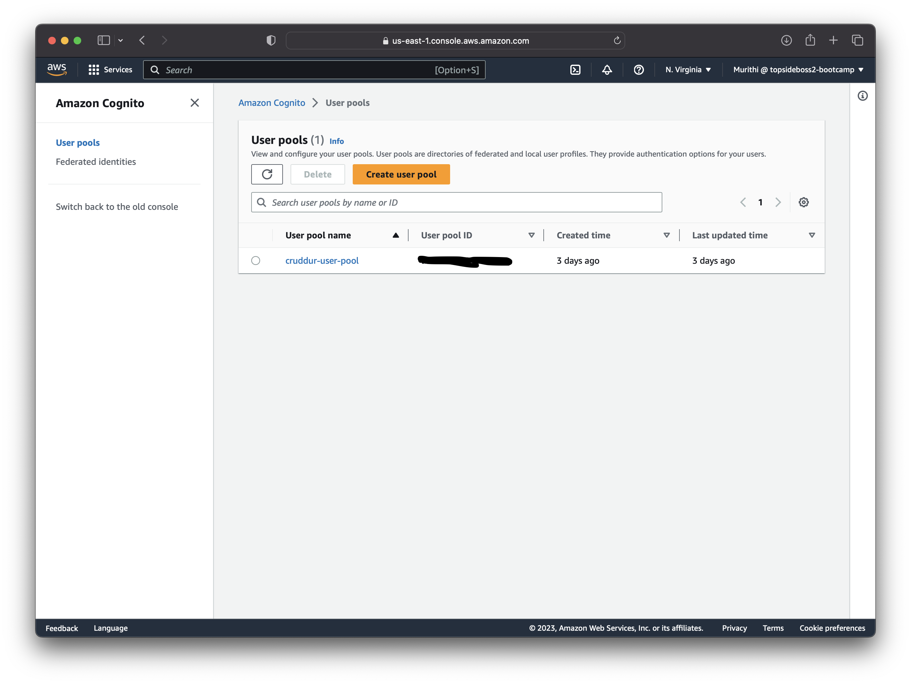

## Install AWS Amplify library
### What is AWS Amplify?
You can think of AWS Amplify as client library that lets you build and deploy serverless applications in the cloud. It is a full-stack application platform that is a combination of both client-side and server-side code. It  includes features such as user authentication, authorization, and analytics that help developers build secure and scalable applications quickly and easily.
I used AWS Amplify to integrate authorization using Amazon Cognito into my code
1. Install AWS Amplify library.

In the `/frontend-react-js/` directory run:
```shell
npm install aws-amplify --save
```
2. Add env vars

In the `docker-compose.yml` file:
```yaml
  frontend-react-js:
    environment:
      REACT_APP_AWS_PROJECT_REGION: "${AWS_DEFAULT_REGION}"
      REACT_APP_AWS_COGNITO_REGION: "${AWS_DEFAULT_REGION}"
      REACT_APP_AWS_USER_POOLS_ID: "us-east-1_*******"
      REACT_APP_CLIENT_ID: "*********************"
```

3. Edit app.js
```javascript
import { Amplify } from 'aws-amplify';

Amplify.configure({
    "AWS_PROJECT_REGION": process.env.REACT_AWS_PROJECT_REGION,
    "aws_cognito_identity_pool_id": process.env.REACT_APP_AWS_COGNITO_IDENTITY_POOL_ID,
    "aws_cognito_region": process.env.REACT_APP_AWS_COGNITO_REGION,
    "aws_user_pools_id": process.env.REACT_APP_AWS_USER_POOLS_ID,
    "aws_user_pools_web_client_id": process.env.REACT_APP_CLIENT_ID,
    "oauth": {},
    Auth: {
        // We are not using an Identity Pool
        // identityPoolId: process.env.REACT_APP_IDENTITY_POOL_ID, // REQUIRED - Amazon Cognito Identity Pool ID
        region: process.env.REACT_AWS_PROJECT_REGION,           // REQUIRED - Amazon Cognito Region
        userPoolId: process.env.REACT_APP_AWS_USER_POOLS_ID,         // OPTIONAL - Amazon Cognito User Pool ID
        userPoolWebClientId: process.env.REACT_APP_AWS_USER_POOLS_WEB_CLIENT_ID,   // OPTIONAL - Amazon Cognito Web Client ID (26-char alphanumeric string)
    }
});
```

3. Edit homefeedpage.js

```javascript
import { Auth } from 'aws-amplify';

// set a state
const [user, setUser] = React.useState(null);

// check if we are authenicated
const checkAuth = async () => {
  Auth.currentAuthenticatedUser({
    // Optional, By default is false. 
    // If set to true, this call will send a 
    // request to Cognito to get the latest user data
    bypassCache: false 
  })
  .then((user) => {
    console.log('user',user);
    return Auth.currentAuthenticatedUser()
  }).then((cognito_user) => {
      setUser({
        display_name: cognito_user.attributes.name,
        handle: cognito_user.attributes.preferred_username
      })
  })
  .catch((err) => console.log(err));
};

// check when the page loads if we are authenicated
React.useEffect(()=>{
  loadData();
  checkAuth();
}, [])
```

4. Edit `DesktopNavigation.js`

```javascript
import './DesktopNavigation.css';
import {ReactComponent as Logo} from './svg/logo.svg';
import DesktopNavigationLink from '../components/DesktopNavigationLink';
import CrudButton from '../components/CrudButton';
import ProfileInfo from '../components/ProfileInfo';

export default function DesktopNavigation(props) {

  let button;
  let profile;
  let notificationsLink;
  let messagesLink;
  let profileLink;
  if (props.user) {
    button = <CrudButton setPopped={props.setPopped} />;
    profile = <ProfileInfo user={props.user} />;
    notificationsLink = <DesktopNavigationLink 
      url="/notifications" 
      name="Notifications" 
      handle="notifications" 
      active={props.active} />;
    messagesLink = <DesktopNavigationLink 
      url="/messages"
      name="Messages"
      handle="messages" 
      active={props.active} />
    profileLink = <DesktopNavigationLink 
      url="/@andrewbrown" 
      name="Profile"
      handle="profile"
      active={props.active} />
  }

  return (
    <nav>
      <Logo className='logo' />
      <DesktopNavigationLink url="/" 
        name="Home"
        handle="home"
        active={props.active} />
      {notificationsLink}
      {messagesLink}
      {profileLink}
      <DesktopNavigationLink url="/#" 
        name="More" 
        handle="more"
        active={props.active} />
      {button}
      {profile}
    </nav>
  );
}
```

5. Edit `ProfileInfo.js`

```javascript
import { Auth } from 'aws-amplify';

const signOut = async () => {
  try {
      await Auth.signOut({ global: true });
      window.location.href = "/"
  } catch (error) {
      console.log('error signing out: ', error);
  }
}
```

6. Edit `DesktopSidebar.js`

```javascript
import './DesktopSidebar.css';
import Search from '../components/Search';
import TrendingSection from '../components/TrendingsSection'
import SuggestedUsersSection from '../components/SuggestedUsersSection'
import JoinSection from '../components/JoinSection'

export default function DesktopSidebar(props) {
  const trendings = [
    {"hashtag": "100DaysOfCloud", "count": 2053 },
    {"hashtag": "CloudProject", "count": 8253 },
    {"hashtag": "AWS", "count": 9053 },
    {"hashtag": "FreeWillyReboot", "count": 7753 }
  ]

  const users = [
    {"display_name": "Andrew Brown", "handle": "andrewbrown"}
  ]

  let trending;
  let suggested;
  let join;
  if (props.user) {
    trending = <TrendingSection trendings={trendings} />
    suggested = <SuggestedUsersSection users={users} />
    } else {
      join = <JoinSection />
    }
  
  return (
    <section>
      <Search />
      {trending}
      {suggested}
      {join}
      <footer>
        <a href="#">About</a>
        <a href="#">Terms of Service</a>
        <a href="#">Privacy Policy</a>
      </footer>
    </section>
  );
}
```
## Create a user through the Console
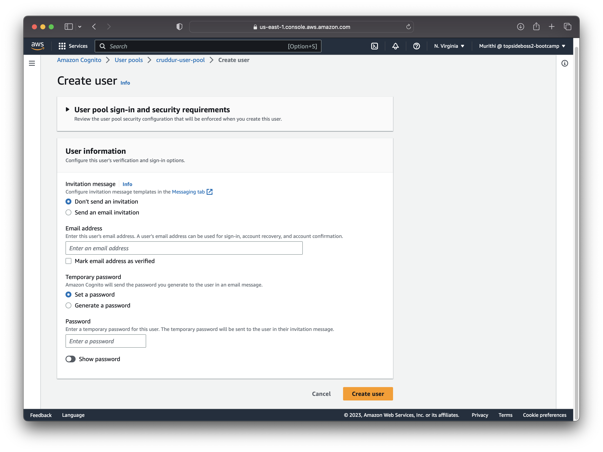

## Verify said user through the CLI
```shell
aws cognito-idp admin-set-user-password --user-pool-id "us-east-1_******" --username ******* --password ****** --permanent
```

## Sign-in Page
In `SigninPage.js`:
```javascript
import { Auth } from 'aws-amplify';

const [cognitoErrors, setCognitoErrors] = React.useState('');

const onsubmit = async (event) => {
  setCognitoErrors('')
  event.preventDefault();
  try {
    Auth.signIn(username, password)
      .then(user => {
        localStorage.setItem("access_token", user.signInUserSession.accessToken.jwtToken)
        window.location.href = "/"
      })
      .catch(err => { console.log('Error!', err) });
  } catch (error) {
    if (error.code == 'UserNotConfirmedException') {
      window.location.href = "/confirm"
    }
    setCognitoErrors(error.message)
  }
  return false
}

let errors;
if (cognitoErrors){
  errors = <div className='errors'>{cognitoErrors}</div>;
}

// just before submit component
{errors}
```
The SigninPage.js in question:
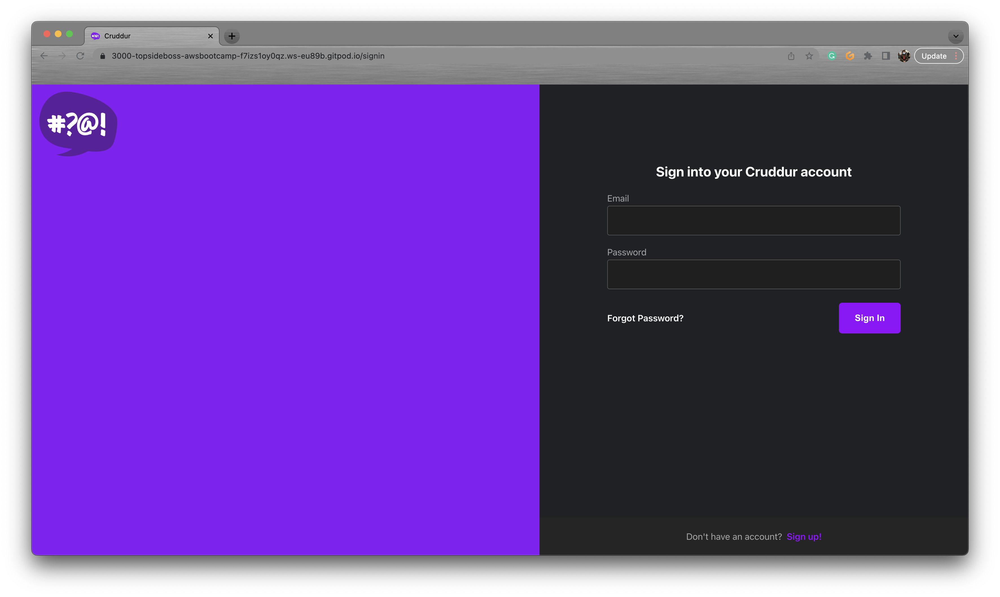
## Sign-up Page
In `SignupPage.js`:
```javascript
import { Auth } from 'aws-amplify';

const [cognitoErrors, setCognitoErrors] = React.useState('');

const onsubmit = async (event) => {
  event.preventDefault();
  setCognitoErrors('')
  try {
      const { user } = await Auth.signUp({
        username: email,
        password: password,
        attributes: {
            name: name,
            email: email,
            preferred_username: username,
        },
        autoSignIn: { // optional - enables auto sign in after user is confirmed
            enabled: true,
        }
      });
      console.log(user);
      window.location.href = `/confirm?email=${email}`
  } catch (error) {
      console.log(error);
      setCognitoErrors(error.message)
  }
  return false
}

let errors;
if (cognitoErrors){
  errors = <div className='errors'>{cognitoErrors}</div>;
}

//before submit component
{errors}
```

## Confirmation Page
```javascript
const resend_code = async (event) => {
  setCognitoErrors('')
  try {
    await Auth.resendSignUp(email);
    console.log('code resent successfully');
    setCodeSent(true)
  } catch (err) {
    // does not return a code
    // does cognito always return english
    // for this to be an okay match?
    console.log(err)
    if (err.message == 'Username cannot be empty'){
      setCognitoErrors("You need to provide an email in order to send Resend Activiation Code")   
    } else if (err.message == "Username/client id combination not found."){
      setCognitoErrors("Email is invalid or cannot be found.")   
    }
  }
}

const onsubmit = async (event) => {
  event.preventDefault();
  setCognitoErrors('')
  try {
    await Auth.confirmSignUp(email, code);
    window.location.href = "/"
  } catch (error) {
    setCognitoErrors(error.message)
  }
  return false
}
```
The Confirmation Page in question:
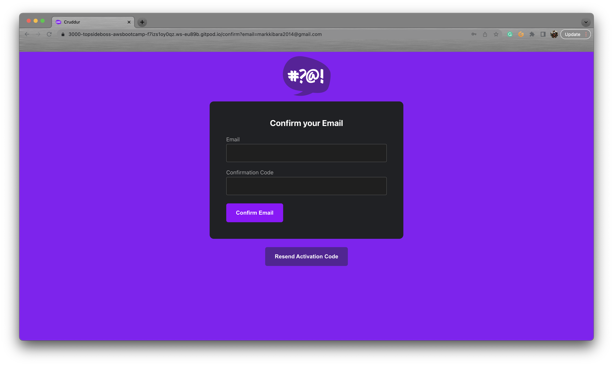

## Password recovery Page
```javascript
import { Auth } from 'aws-amplify';

const onsubmit_send_code = async (event) => {
  event.preventDefault();
  setCognitoErrors('')
  Auth.forgotPassword(username)
  .then((data) => setFormState('confirm_code') )
  .catch((err) => setCognitoErrors(err.message) );
  return false
}

const onsubmit_confirm_code = async (event) => {
  event.preventDefault();
  setCognitoErrors('')
  if (password == passwordAgain){
    Auth.forgotPasswordSubmit(username, code, password)
    .then((data) => setFormState('success'))
    .catch((err) => setCognitoErrors(err.message) );
  } else {
    setCognitoErrors('Passwords do not match')
  }
  return false
}

## Authenticating Server Side

Add in the `HomeFeedPage.js` a header eto pass along the access token

```js
  headers: {
    Authorization: `Bearer ${localStorage.getItem("access_token")}`
  }
```
The Password recovery page in question:
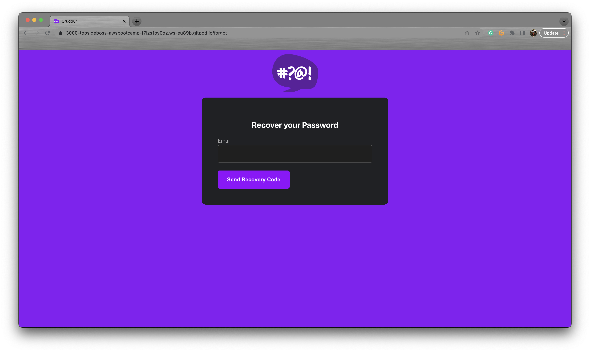

## Implement the use of a JSON Web Token
### What is a JWT?

This image from Twitter helped me understand further what a JSON Web Token is and how it works.

